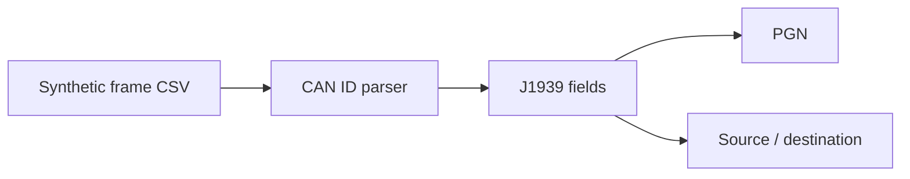

# J1939 CAN Bench Reader

[](https://github.com/guilherme-lacerda-tech/j1939-can-bench-reader/actions/workflows/ci.yml)

[](https://github.com/guilherme-lacerda-tech/j1939-can-bench-reader/releases)
[](LICENSE)

Synthetic CAN/J1939 parser lab for 29-bit identifier decomposition and bench-friendly examples.

## Why / Problem

CAN/J1939 examples should be safe to publish and easy to test. This project uses synthetic frames to demonstrate parser behavior without private captures.

## Features

- 29-bit CAN ID validation.
- Priority, reserved bit, data page, PDU format and PDU specific extraction.
- PDU1/PDU2-aware PGN calculation.
- Source address and destination address handling.
- Synthetic CSV frame parsing.
- CI with Ruff, PyTest and coverage.

## Architecture



## Tech Stack

Current: `Python` `CSV` `CAN` `J1939 concepts` `Arduino demo` `PyTest` `Ruff`

Planned: adapter abstraction for future bench tests and more public synthetic PGN examples.

## Quick Start

```powershell
python -m pip install -e ".[dev]"
python examples/run_demo.py
```

## Tests

```powershell
python -m pytest --cov --cov-report=term-missing
python -m ruff check .
```

## Example Output

```text
Frames parsed: 3
First PGN: 65281
```

## Project Structure

- `src/j1939_can_bench_reader/parser.py`: parser logic.
- `data/sample/synthetic_frames.csv`: safe synthetic frames.
- `firmware`: generic serial demo.
- `tests`: PDU1, PDU2, prefixed ID and validation tests.

## Engineering Decisions

- No real bus captures are included.
- Parser logic is isolated so tests do not need hardware.
- PDU1/PDU2 behavior is covered because it is the core technical value.

## Roadmap

See [ROADMAP.md](ROADMAP.md).

## Security

All frames are synthetic and public-safe. No private protocol extensions, customer data or employer captures are included.
