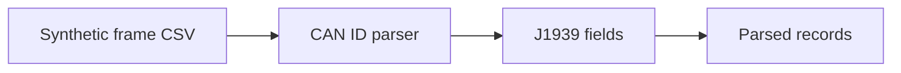

# J1939 CAN Bench Reader

Independent public portfolio project for **Python**, **CAN**, **J1939 parsing** and **bench documentation**.

This repository was created from scratch with synthetic frames and generic examples. It does not contain corporate code, real data, private endpoints, credentials, logs or proprietary rules.

## Problem

CAN bench examples need safe synthetic frames and a parser that explains 29-bit J1939 identifiers without relying on private captures.

## What It Demonstrates

- 29-bit CAN ID validation.
- Priority, reserved bit and data page extraction.
- PDU format and PDU specific decomposition.
- PGN calculation for PDU1 and PDU2 frames.
- Source address and destination address handling.
- Synthetic CSV frame parsing and focused tests.

## Architecture



See [docs/architecture.md](docs/architecture.md) for details.

## Stack

`Python` `CSV` `CAN` `J1939 concepts` `Arduino demo` `PyTest`

## Run Locally

```powershell
python -m pip install -e .
python examples/run_demo.py
```

## Run Tests

```powershell
python -m pip install -e ".[dev]"
pytest
```

## Technical Decisions

- Frames are synthetic and created only to exercise parser behavior.
- The parser handles PDU1 and PDU2 PGN rules because this is the core technical value of the project.
- Hardware support remains separate from the parser so tests do not require a CAN adapter.

## Roadmap

- Add more public synthetic PGN examples.
- Add adapter abstraction for future bench tests.
- Add documentation references to public protocol material.

## Security and Independence

See [SECURITY.md](SECURITY.md) and [DISCLAIMER.md](DISCLAIMER.md).
