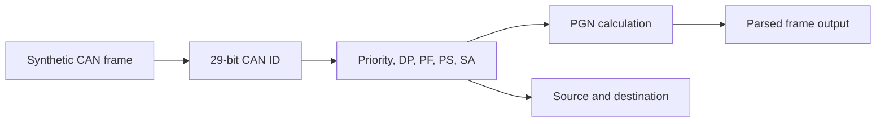

# Architecture

## Design Goal

Provide a public CAN/J1939 bench parser using only synthetic frames and public protocol concepts.

## Parser Flow

## J1939 Boundary

The parser decomposes 29-bit identifiers into generic J1939 fields. For PDU1 frames, `pdu_specific` is treated as destination address and excluded from PGN. For PDU2 frames, `pdu_specific` is part of the PGN.
